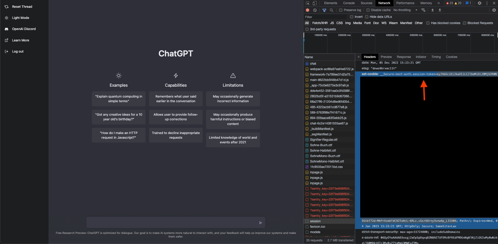
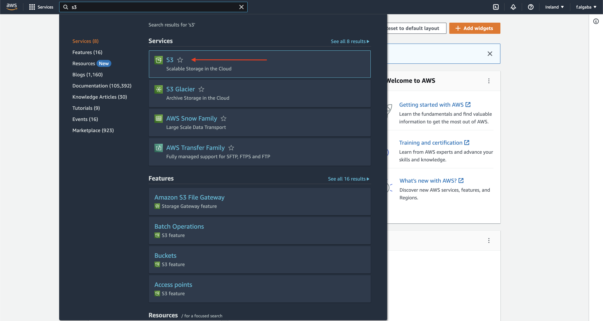
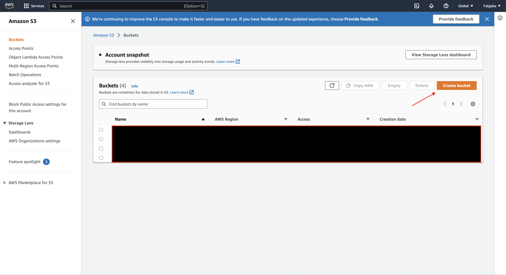
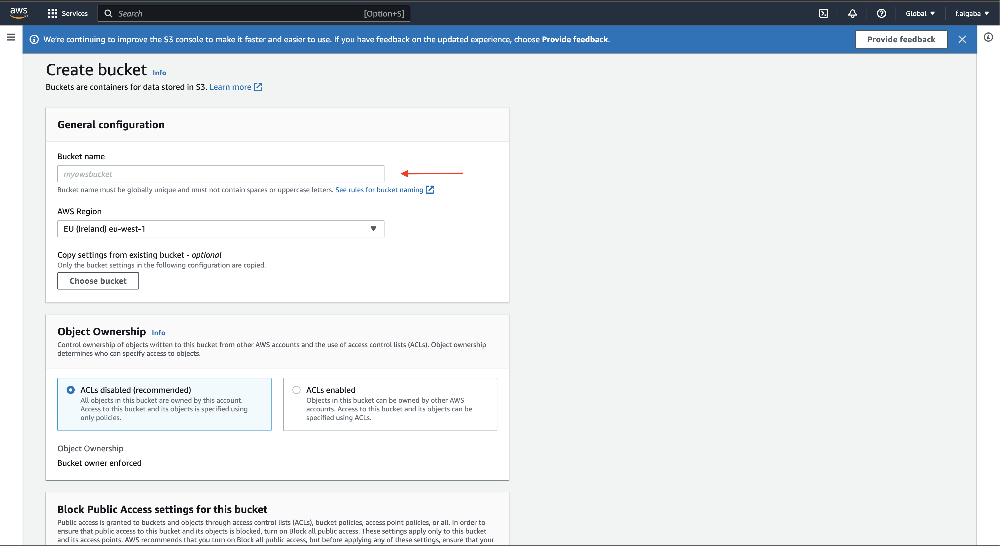

# ChatGPT Telegram Bot in AWS Lambda

This a Telegram bot that lets you chat with [ChatGPT](https://openai.com/blog/chatgpt/). This bot is created using the [**brand new ChatGPT API**](https://openai.com/blog/introducing-chatgpt-and-whisper-apis). The Telegram bot is deployed in completely serverless in AWS Lambda. No need to setup a local server or do login in the browser.

# Features

- [x] **New ChatGPT API support.** :brain:
- [x] **Voice messages support!** :fire:
- [x] **Markdown rendering support.**

    

# Initial Setup

1. Create an [OpenAI account](https://openai.com/api/) and [get an API Key](https://platform.openai.com/account/api-keys).
2. Create an [AWS account](https://aws.amazon.com/es/).
3. Setup your Telegram bot. You can follow [this instructions](https://core.telegram.org/bots/tutorial#obtain-your-bot-token) to get your token.

4. To enable support for voice messages you need to create a S3 bucket in your AWS account.
- Go to the top search bar and write `S3`.

- Click the Create Bucket button.

- Configure the creation of your bucket. The name must be unique worldwide. Scroll to bottom and click Create Bucket and don't change any other configuration.

5. Go to `.chalice/config.json` and stablish the configurations:
- `TELEGRAM_TOKEN` with your Telegram token. 
- `OPENAI_API_KEY` with the value of your Open AI API Token.
- `VOICE_MESSAGES_BUCKET` with the bucket name you created previously.

# Installation

1. Install Python using [pyenv](https://github.com/pyenv/pyenv-installer) or your prefered Python installation.
2. Create a virtual environment: `python3 -m venv .venv`.
3. Activate you virtual environment: `source .venv/bin/activate`.
4. Install dependencies: `pip install -r requirements.txt`.
5. [Install the AWS CLI](https://docs.aws.amazon.com/cli/latest/userguide/getting-started-install.html) and [configure your credentials](https://docs.aws.amazon.com/cli/latest/userguide/getting-started-quickstart.html).

# Deployment

1. Run `chalice deploy`.
2. Go to the AWS Console -> Lambda -> chatgpt-telegram-bot-dev-message-handler-lambda -> Configuration -> Function URL.
3. Click Create Function URL and set Auth type to NONE.
4. Copy the created function URL.
5. Establish your Telegram webhook to point to you AWS Lambda running `curl --request POST --url https://api.telegram.org/bot<YOUR_TELEGRAM_TOKEN>/setWebhook --header 'content-type: application/json' --data '{"url": "<YOUR_FUNCTION_URL"}'`

Great! Everything is setup :) Now go to Telegram and find your bot name and use ChatGPT from there!

# Coming soon!

- [x] Decoupled Token refresh in conversation.
- [x] Increase response performance.
- [x] Error handling from ChatGPT services.
- [ ] Deploy solution with one-click using CloudFormation.

# Credits

- [ChatGPT Telegram Bot - @altryne
  ](https://github.com/altryne/chatGPT-telegram-bot)
- [whatsapp-gpt](https://github.com/danielgross/whatsapp-gpt)
- [ChatGPT Reverse Engineered API](https://github.com/acheong08/ChatGPT)
